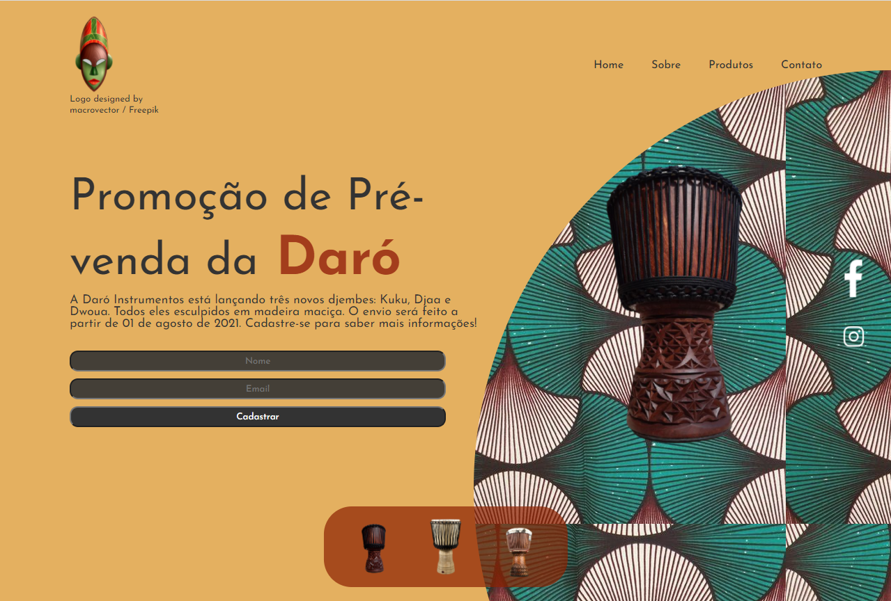

# Desafio 1 - Hiring Coders 2

## Introdução

O intuito do projeto é criar uma `Landing Page` com um sistema de e-commerce para cadastro de email, onde o usuário receberia novidades e promoções a partir dele.

## Sobre o projeto

A página foi pensada como uma landing page responsiva de promoção de pré-vendas da empresa ficitcía Daró Instrumentos, onde três novos produtos são apresentados.



```
Link Netlify: https://daro-instrumentos.netlify.app
```
